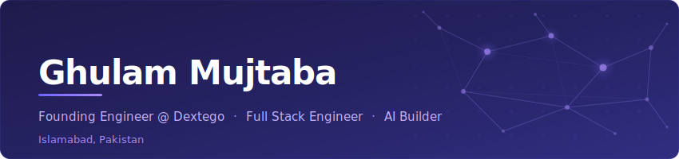

<!-- ═══════════════════════════════════════════════════════════════════ -->
<!--                        GHULAM MUJTABA                            -->
<!-- ═══════════════════════════════════════════════════════════════════ -->

  

  

  &nbsp;
  &nbsp;
  

 

<!-- ─── ABOUT ─────────────────────────────────────────────────────── -->

Full stack engineer based in Islamabad, Pakistan with **3+ years** of experience building **production-grade AI applications** end-to-end. I work across the entire stack — from **React/Next.js** frontends to **Node.js/NestJS + GraphQL** backends deployed on **AWS** and **Cloudflare Workers** infrastructure.

Currently a **Founding Engineer at [Dextego](https://dextego.com)** — an AI coaching platform that helps sales teams prepare for critical conversations with real-time, personalized guidance.

> **Currently:** Building an AI-powered coaching agent at Dextego — using Mastra for agent orchestration and OpenAI, deployed on Vercel

**What I specialize in:**

- **AI/LLM Engineering** — agentic RAG pipelines, multi-model orchestration (OpenAI, Claude, Gemini), Mastra agents, vector search, embeddings
- Full stack **TypeScript** applications at scale
- **Edge & Cloud Infrastructure** — Cloudflare Workers, Durable Objects, D1, R2, Queues, AWS, Docker
- Real-time systems — **GraphQL subscriptions**, **WebSockets**, **SSE streaming**
- **Async architectures** — message queues, dead-letter queues, cron-based pipelines, background job processing
- **Vector databases & search** — Qdrant (hybrid dense + sparse), semantic search, query optimization
- Data pipelines & analytics — **TinyBird**, **PostgreSQL**, **Redis**
- Payment & third-party integrations — **Stripe**, **Zoom**, **Twilio**, **Sentry**, **PostHog**

 

  <i>"Don't bend; don't water it down; don't try to make it logical; don't edit your own soul according to the fashion."</i> 
  <b>— Franz Kafka</b>

 

<!-- ─── EXPERIENCE TIMELINE ───────────────────────────────────────── -->

## Where I've Built

<table>
  <tr>
    <td align="center" width="90"><b>2024 →</b></td>
    <td>
      <b>Founding Engineer</b> — <a href="https://dextego.com">Dextego</a> &nbsp;🇺🇸 
      AI coaching platform delivering real-time, personalized coaching for sales teams before critical conversations. Building the core platform — AI-driven roleplay, buyer psychographic profiling (DISC/OCEAN models), and real-time feedback systems helping teams achieve higher win rates and shorter sales cycles.
    </td>
  </tr>
  <tr>
    <td align="center" width="90"><b>2024 →</b></td>
    <td>
      <b>Full Stack Engineer</b> — <a href="https://dataspecc.com">Dataspecc</a> &nbsp;📍 Islamabad 
      Building and shipping AI-powered products and scalable platforms. Working across multiple products including <a href="https://sociali.ai">Sociali.ai</a>, <a href="https://cardclan.io">CardClan</a>, and others — handling everything from frontend architecture to backend infrastructure and cloud deployment.
    </td>
  </tr>
  <tr>
    <td align="center" width="90"><b>2023–24</b></td>
    <td>
      <b>Software Engineer</b> — Niftonic &nbsp;📍 Islamabad 
      Led development of a production telemedicine app and social media platform. Implemented real-time <b>GraphQL subscriptions</b>, integrated <b>Stripe</b> payments, set up <b>AWS</b> infrastructure with <b>Docker</b>, and mentored junior developers in React.js.
    </td>
  </tr>
  <tr>
    <td align="center" width="90"><b>2023</b></td>
    <td>
      <b>Blockchain / MERN Intern</b> — Bytewise & EMRChains 
      Solidity smart contracts, MERN stack fundamentals, API development, and UI engineering.
    </td>
  </tr>
</table>

 

<!-- ─── TECH STACK ────────────────────────────────────────────────── -->

## Tech Stack

<table>
  <tr>
    <td valign="top" width="20%">
      <h4 align="center">AI / LLM</h4>
      

        
        
        
        
        
        
        
        
      

    </td>
    <td valign="top" width="20%">
      <h4 align="center">Frontend</h4>
      

        
        
        
        
        
        
        
        
      

    </td>
    <td valign="top" width="20%">
      <h4 align="center">Backend</h4>
      

        
        
        
        
        
        
        
      

    </td>
    <td valign="top" width="20%">
      <h4 align="center">Cloud & Data</h4>
      

        
        
        
        
        
        
        
        
        
      

    </td>
    <td valign="top" width="20%">
      <h4 align="center">Infra & Tools</h4>
      

        
        
        
        
        
        
        
        
      

    </td>
  </tr>
</table>

 

<!-- ─── FEATURED PROJECTS ─────────────────────────────────────────── -->

## Featured Projects

<table>
  <tr>
    <td width="50%">
      <h3 align="center">Dextego — AI Coaching Platform</h3>
      

        
      

      

        AI-powered real-time coaching platform for sales teams. Delivers personalized coaching through AI-driven roleplay with four specialized coaches, buyer psychographic profiling using DISC & OCEAN frameworks, and instant feedback on clarity, confidence, and influence.
      

      

        
        
        
        
        
      

    </td>
    <td width="50%">
      <h3 align="center">Sociali.ai</h3>
      

        
      

      

        AI-powered social media management platform (formerly BrandSocial). Optimized analytics across Facebook, Instagram & LinkedIn. Resolved timezone scheduling issues, built smart content scheduling, and multi-brand management features.
      

      

        
        
        
        
        
      

    </td>
  </tr>
  <tr>
    <td width="50%">
      <h3 align="center">TreeTalk Therapy</h3>
      

        
      

      

        Production telemedicine platform connecting therapists with clients. Built the entire frontend, integrated Zoom video sessions, real-time chat, Firebase cloud functions, and Stripe payment processing.
      

      

        
        
        
        
      

    </td>
    <td width="50%">
      <h3 align="center">CardClan</h3>
      

        
      

      

        Digital greeting card platform for businesses. Personalized card creation with custom GIFs and branding, bulk CSV sending, engagement analytics, group cards, and workspace management. Serving 1,000+ companies.
      

      

        
        
        
      

    </td>
  </tr>
  <tr>
    <td width="50%" colspan="2">
      <h3 align="center">ALLTRUEistic</h3>
      

        
      

      

        Full-stack social media platform with admin panel. Consolidated API endpoints for performance, resolved real-time GraphQL subscription issues, and built the admin dashboard with Apollo Client. Deployed on <b>AWS</b> with <b>Docker</b>.
      

      

        
        
        
        
        
        
      

    </td>
  </tr>
</table>

 

<!-- ─── CONNECT ───────────────────────────────────────────────────── -->

### Let's Build Something Together

Whether it's an AI product, a full-stack platform, or an ambitious startup idea — I'm always up for a conversation.

  &nbsp;
  

